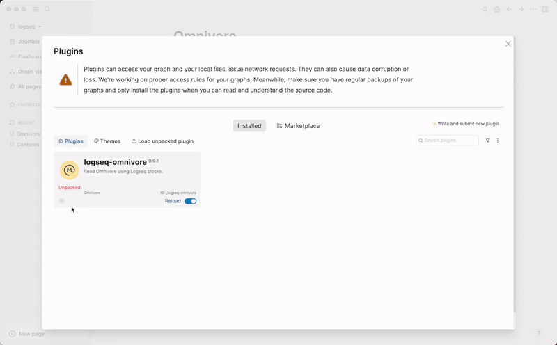
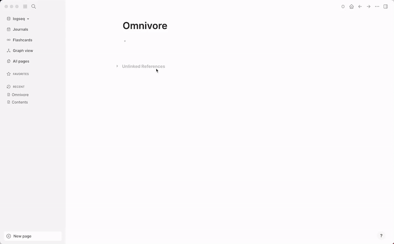

# logseq-omnivore

This plugin helps you to read Omnivore articles and highlights from Logseq.

## Installation

1. Install the plugin from the marketplace or build it from source and load unpacked plugin.
2. Open settings and add your api key and username.
3. Click on the "O" button on the toolbar.

## Demo

