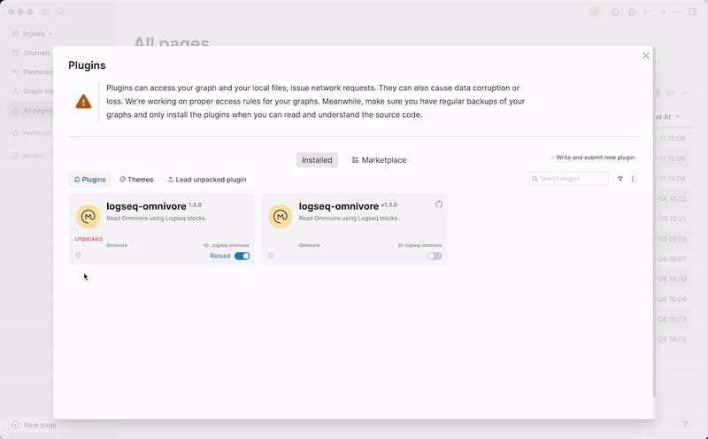
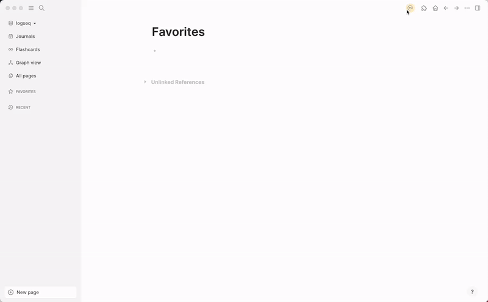

# logseq-omnivore

This plugin helps you to read [Omnivore](https://omnivore.app/) articles and highlights from Logseq.

## Features

* Read articles, highlights and labels from Omnivore
* Create graphs based on Omnivore data

## Installation

1. Install the plugin from the marketplace or build it from source and load unpacked plugin
2. Create an API key in [Omnivore](https://omnivore.app/settings/api) for Logseq
3. Open settings and add your api key and username and how frequent you want the plugin to sync with Omnivore

## Usage

1. The plugin will automatically sync with Omnivore every time you open the plugin and every time you change the settings
2. You can also manually sync with Omnivore by clicking the Omnivore icon on the toolbar
3. You can also change the API key, username, and how often the plugin syncs with Omnivore by updating the settings
4. We will create a page "Omnivore" and a block for each article containing metadata like labels, nested with highlights underneath
5. Clicking on the article will open the Omnivore article in a new tab
6. We also create an internal link to each label in the article so you can group articles by label
7. Kudos to [Brian](https://twitter.com/Bsunter) for the great [guide](https://briansunter.com/graph/#/page/omnivore-logseq-guide?anchor=ls-block-62b28de3-0e9e-456e-bf29-7e2541213aa5) on how to use Omnivore and the plugin 

## Demo

### Settings

### Fetching

## Roadmap

- [ ] Refactor the plugin to use the new Omnivore API
- [ ] Saving PDFs of the Omnivore article

## Contacts

Developer: [Hongbo Wu](https://github.com/sywhb) @ [Omnivore](https://github.com/omnivore-app)

## Contributing

Pull requests are welcome. For major changes, please open an issue first to discuss what you would like to change.

## License

[MIT](https://choosealicense.com/licenses/mit/)

## FAQ

### I got `TypeError: Cannot read properties of null (reading:’uuid’)` when trying to fetch articles.

This has been fixed in the latest version of the plugin. If you still encounter this issue, please try to click on the empty block on the "Omnivore" page.

### The button to sync with Omnivore is not working after updating settings.

This has been fixed in the latest version of the plugin. If you still encounter this issue, please try to reload the plugin and if it is still not working, please open on issue.
